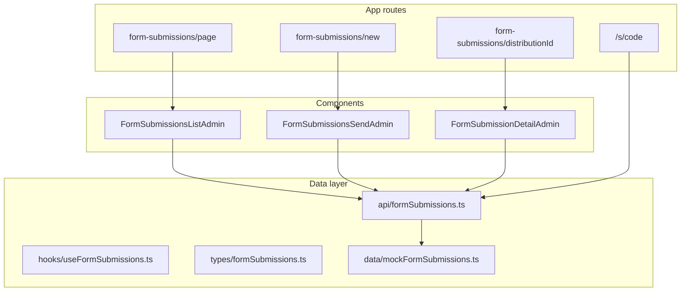

# Form Submissions (Distribution) — Feature Specification

Product and frontend implementation guide for **sending dynamic forms to beneficiaries (and external recipients)** via email and SMS, with delivery tracking and retries.

**Related API contract (backend):** [FORM_BUILDER_DISTRIBUTIONS_API.md](./FORM_BUILDER_DISTRIBUTIONS_API.md)

**Implementation plan (Cursor):** `.cursor/plans/form_submissions_feature_725d02e7.plan.md`

---

## 1. Problem statement

Admins build surveys/forms in **Form Builder**. They need to:

1. Select a published form and choose who receives it (all beneficiaries, one programme, or non-beneficiaries).
2. Notify recipients by **email** and/or **SMS** with templates that include a link to complete the form.
3. Use a **short link** in SMS (character limit).
4. Track each outbound notification (pending, sent, failed) and **retry** failures.
5. Work end-to-end before all APIs exist, using placeholder endpoints that match the backend contract.

This feature is **distribution / notification tracking**, not a UI to browse filled form answers (that is a separate future capability).

---

## 2. User roles and routes

| Audience | Access |
|----------|--------|
| Admin JWT | All routes below |
| Beneficiary | Public form fill only (`/form/{formId}`; legacy `/form-builder/{formId}` redirects) |

### 2.1 Admin navigation

Replace the single sidebar item **Form builder** with a nested group:

```
Forms
  ├── Builder      → /dashboard/admin/form-builder
  └── Submissions  → /dashboard/admin/form-submissions
```

- Mirror the **Set Up** accordion pattern in `components/dashbaord-layout.tsx`.
- Auto-expand **Forms** when the path starts with `/dashboard/admin/form-builder` or `/dashboard/admin/form-submissions`.
- **Builder** child link should **not** use `exact: true` so `/form-builder/new` and `/.../edit` stay active under Builder.

Existing builder URLs stay unchanged.

### 2.2 Admin pages

| Route | Screen |
|-------|--------|
| `/dashboard/admin/form-submissions` | List distributions (past sends) + **Send form** |
| `/dashboard/admin/form-submissions/new` | Compose: form, audience, channels, templates, send |
| `/dashboard/admin/form-submissions/[distributionId]` | Per-recipient notification status, filters, retry |

### 2.3 Public

| Route | Screen |
|-------|--------|
| `/form/[formId]` | Public form fill; `/form-builder/[formId]` redirects here |
| `/s/[code]` | Short-link redirect → resolved full form URL |

### 2.4 Environment

| Variable | Purpose |
|----------|---------|
| `NEXT_PUBLIC_API_URL` | HWSETA API base (existing) |
| `NEXT_PUBLIC_APP_URL` | Portal origin for `formLink` / `shortLink` in templates (new) |

Fallback for `appUrl`: `window.location.origin` in the browser.

---

## 3. Send flow (compose)

**Component target:** `components/admin/FormSubmissionsSendAdmin.tsx`

### 3.1 Form selection

- Load options from `listManageForms()` (`api/formBuilder.ts`).
- Only forms the admin can manage; show title + last updated if available.

### 3.2 Audience

| Type | Value | Behaviour |
|------|-------|-----------|
| All beneficiaries | `all_beneficiaries` | Server expands to all active beneficiaries with contact details for selected channels |
| By programme | `by_programme` | Requires `programmeId`; recipients = enrollees on that programme |
| Non-beneficiaries | `external` | Manual rows + CSV import (see §3.5) |

**Programme picker:** `fetchProgrammeEnrolmentsDrilldown()` from [`lib/programme-enrolments-drilldown.ts`](../lib/programme-enrolments-drilldown.ts) (shared with Programme Enrolments).

**Preview before send:** show counts — total recipients, with email, with cellphone; block send if a selected channel has zero eligible contacts.

### 3.3 Channels

- Checkboxes: **Email**, **SMS** (at least one required).
- Email requires `emailAddress`; SMS requires `cellNo` (normalize SA numbers consistently with `lib/contactValidation.ts`).

### 3.4 Templates

**Email**

- Fields: `emailSubject`, `emailBody` (plain text or HTML per backend; MVP textarea).
- Default body example:

  ```
  Hello {{beneficiaryFirstName}},

  Please complete the form "{{formTitle}}":
  {{formLink}}
  ```

**SMS**

- Field: `smsBody` with live **160-character** counter (see `AdminBeneficiarySmsPanel`).
- Default example:

  ```
  HWSETA: Complete "{{formTitle}}": {{shortLink}}
  ```

**Merge tokens**

| Token | Email | SMS |
|-------|:-----:|:---:|
| `{{formTitle}}` | ✓ | ✓ |
| `{{beneficiaryFirstName}}` | ✓ | ✓ |
| `{{beneficiaryLastName}}` | ✓ | optional |
| `{{formLink}}` | ✓ | avoid (long) |
| `{{shortLink}}` | optional | ✓ (preferred) |

- Preview panel substitutes sample values and shows final SMS length after `{{shortLink}}` expansion.

**Rendering:** MVP may merge on the client for preview; **production** should merge on the server when each notification is queued so stored content matches what was sent.

### 3.5 Non-beneficiaries (external)

- **Manual rows:** add/remove; columns: `fullName` (optional), `email`, `cellphone`.
- **CSV:** upload or paste; headers `fullName`, `email`, `cellphone` (case-insensitive).
- Validate emails/phones; show row-level errors; dedupe by email or cellphone.
- Payload: `externalRecipients[]` on create distribution (see API doc).

### 3.6 Submit

- `POST` create distribution with `createdByUserId` from admin JWT.
- On success: navigate to `/dashboard/admin/form-submissions/{distributionId}` or list with success toast.

---

## 4. Submissions list

**Component target:** `components/admin/FormSubmissionsListAdmin.tsx`

### 4.1 Grid columns

| Column | Notes |
|--------|-------|
| Form | `formTitle` |
| Audience | e.g. All / Programme name / External |
| Channels | Email, SMS, or both |
| Created | `createdAt` |
| Status | Distribution aggregate status |
| Recipients | `totalRecipients` |
| Sent / Failed / Pending | counts |
| Actions | **View** → detail page |

### 4.2 Filters

- Form (`formId`)
- Audience type
- Status (`Queued`, `Processing`, `Completed`, `CompletedWithFailures`, `Failed`)
- Date range (created)
- Search (form title, created-by name)

### 4.3 Pagination and actions

- Server pagination: `page`, `pageSize` (align with `BeneficiariesAdmin`).
- **Refresh** (`refetch`, `retry: false` in React Query).
- **Send form** → `/new`.
- Optional **Export Excel** for current page (`ultis/exportExcel.ts`, `.xlsx` only).

### 4.4 Styling

Follow HWSETA grid rules (`.cursor/rules/hwseta-grid-style.mdc`): green header, `overflow-x-auto rounded-xl border`, row hover `hover:bg-emerald-50/30`.

---

## 5. Distribution detail (notifications)

**Component target:** `components/admin/FormSubmissionDetailAdmin.tsx`

### 5.1 Header

- Form title (link to `/form/{formId}` optional)
- Audience summary, channels, created at
- Aggregate: sent / failed / pending

### 5.2 Notification grid

| Column | Notes |
|--------|-------|
| Recipient type | Beneficiary / External |
| Name | `fullName` |
| Email | |
| Cellphone | |
| Channel | `email` \| `sms` |
| Status | `pending`, `sent`, `failed`, `delivered` |
| Sent at | |
| Error | when `failed` |
| Actions | **Retry** when `failed` |

### 5.3 Filters

- Channel, status, search (name/email/phone), sent date range

### 5.4 Actions

- Row **Retry** → `POST .../notifications/{notificationId}/retry`
- Toolbar **Retry all failed** → `POST .../notifications/retry-failed`

---

## 6. Frontend architecture



### 6.1 Files to add

| File | Role |
|------|------|
| `types/formSubmissions.ts` | DTOs shared with API doc |
| `api/formSubmissions.ts` | HTTP + normalization + mock fallback |
| `data/mockFormSubmissions.ts` | Seed data when API 404 |
| `hooks/useFormSubmissions.ts` | React Query keys |
| `components/admin/FormSubmissions*.tsx` | UI |
| `app/dashboard/admin/form-submissions/**` | Route shells |
| `app/s/[code]/page.tsx` | Short-link redirect |
| `config/environment.ts` | `appUrl` |

### 6.2 Placeholder strategy

1. Call real manage endpoints (see API doc).
2. On 404 / network error, use `data/mockFormSubmissions.ts` (same pattern as `api/webinars.ts`).
3. When backend is live, mocks are bypassed automatically.

### 6.3 Dependencies on existing APIs

| Existing API | Use |
|--------------|-----|
| `listManageForms` | Form dropdown |
| `GET /api/Admin/programme-enrollments/drilldown` | Programme dropdown |
| `GET /api/Admin/programme-enrollments/beneficiaries` | Programme audience (mock expansion) |
| `listAdminBeneficiaries` | All-beneficiary audience (until server fan-out) |
| `GET/POST .../communication-settings` | SMTP / WinSMS config for actual send (backend) |

---

## 7. Testing checklist

1. Sidebar **Forms** expands; **Builder** and **Submissions** highlight on correct routes.
2. Send with **all** / **programme** / **external** (manual + CSV).
3. Email only, SMS only, both; blocked when no contacts for chosen channel.
4. SMS preview ≤ 160 chars after short-link substitution.
5. `/s/{code}` redirects to the correct form URL.
6. Detail filters and pagination work.
7. Retry single and retry all failed update UI state.
8. With API offline, mock layer keeps flows usable.

---

## 8. Out of scope (this release)

- Admin grid of **completed form responses** (answers from `submitPublicForm`).
- Saved organisation-wide template library (per-send templates only).
- Short-link click analytics and signed one-time tokens (optional `?t=` on `targetUrl` later).

---

## 9. Implementation order

1. Navigation (Forms submenu)
2. Types + API module + mocks
3. `NEXT_PUBLIC_APP_URL` + `/s/[code]`
4. Send page (`/new`)
5. List page
6. Detail page + retry
7. Wire real API when backend deploys ([API doc](./FORM_BUILDER_DISTRIBUTIONS_API.md))

---

## 10. Document index

| Document | Audience |
|----------|----------|
| This file | Product, frontend, QA |
| [FORM_BUILDER_DISTRIBUTIONS_API.md](./FORM_BUILDER_DISTRIBUTIONS_API.md) | Backend / API implementers |
| `.cursor/plans/form_submissions_feature_725d02e7.plan.md` | Agent implementation checklist |
